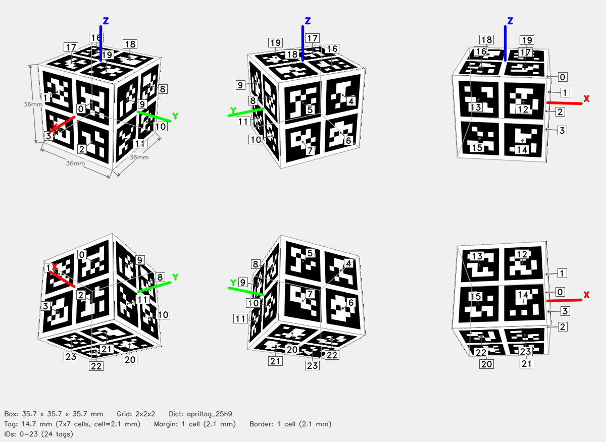

# ArUco Cube — 2x2x2



## Parameters

| Parameter | Value |
|-----------|-------|
| Dictionary | `apriltag_25h9` |
| Grid | 2x2x2 (X x Y x Z tags) |
| Box dimensions | 35.7 x 35.7 x 35.7 mm |
| Tag size | 14.7 mm (7x7 cells) |
| Cell size | 2.1 mm |
| Margin | 1 cell (2.1 mm) |
| Border | 1 cell (2.1 mm) |
| Total tags | 24 |
| Tag IDs | 0–23 |

## Face Layout

| Face | Tag IDs |
|------|---------|
| +X | 0, 1, 2, 3 |
| -X | 4, 5, 6, 7 |
| +Y | 8, 9, 10, 11 |
| -Y | 12, 13, 14, 15 |
| +Z | 16, 17, 18, 19 |
| -Z | 20, 21, 22, 23 |

## Files

| File | Description |
|------|-------------|
| `cube.3mf` | Multi-color 3MF for Bambu Studio |
| `config.json` | Detector config (used by `detect_cube.py`) |
| `thumbnail.png` | 6-view preview |
| `mujoco/cube.xml` | MuJoCo MJCF model |
| `mujoco/cube.obj` | Wavefront OBJ mesh (UV-mapped) |
| `mujoco/cube.mtl` | OBJ material file |
| `mujoco/cube_atlas.png` | Texture atlas |

## Config JSON

```json
{
  "dict": "apriltag_25h9",
  "grid": "2x2x2",
  "tag_ids": [
    0,
    1,
    2,
    3,
    4,
    5,
    6,
    7,
    8,
    9,
    10,
    11,
    12,
    13,
    14,
    15,
    16,
    17,
    18,
    19,
    20,
    21,
    22,
    23
  ],
  "faces": {
    "+X": [
      0,
      1,
      2,
      3
    ],
    "-X": [
      4,
      5,
      6,
      7
    ],
    "+Y": [
      8,
      9,
      10,
      11
    ],
    "-Y": [
      12,
      13,
      14,
      15
    ],
    "+Z": [
      16,
      17,
      18,
      19
    ],
    "-Z": [
      20,
      21,
      22,
      23
    ]
  },
  "tag_size_mm": 14.7,
  "cell_size_mm": 2.1,
  "margin_cells": 1,
  "border_cells": 1,
  "marker_pixels": 7,
  "box_dims": [
    35.7,
    35.7,
    35.7
  ]
}
```

## Regenerate

```bash
python generate_cube.py --grid 2x2x2 --dict apriltag_25h9 --tag-size 14.7 --margin-cell 1 --border-cell 1 -o aruco_cube
```
