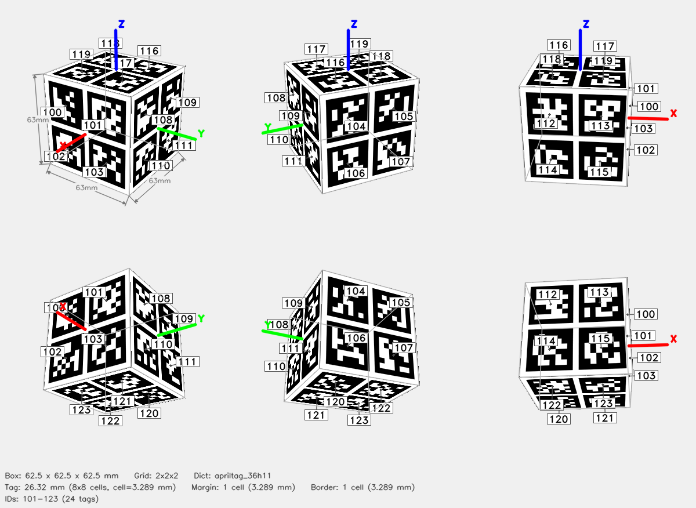

# ArUco Cube — 2x2x2



## Parameters

| Parameter | Value |
|-----------|-------|
| Dictionary | `apriltag_36h11` |
| Grid | 2x2x2 (X x Y x Z tags) |
| Box dimensions | 62.5 x 62.5 x 62.5 mm |
| Tag size | 26.32 mm (8x8 cells) |
| Cell size | 3.289 mm |
| Margin | 1 cell (3.289 mm) |
| Border | 1 cell (3.289 mm) |
| Total tags | 24 |
| Tag IDs | 101–123 |

## Face Layout

| Face | Tag IDs |
|------|---------|
| +X | 101, 100, 103, 102 |
| -X | 105, 104, 107, 106 |
| +Y | 109, 108, 111, 110 |
| -Y | 113, 112, 115, 114 |
| +Z | 118, 119, 116, 117 |
| -Z | 120, 121, 122, 123 |

## Files

| File | Description |
|------|-------------|
| `cube.3mf` | Multi-color 3MF for Bambu Studio |
| `config.json` | Detector config (used by `detect_cube.py`) |
| `thumbnail.png` | 6-view preview |
| `mujoco/cube.xml` | MuJoCo MJCF model |
| `mujoco/cube.obj` | Wavefront OBJ mesh (UV-mapped) |
| `mujoco/cube.mtl` | OBJ material file |
| `mujoco/cube_atlas.png` | Texture atlas |

## Config JSON

```json
{
  "schema_version": 1,
  "target": {
    "type": "cuboid",
    "grid": "2x2x2"
  },
  "dict": "apriltag_36h11",
  "tag_pattern_mirrored": true,
  "grid": "2x2x2",
  "tag_ids": [
    101,
    100,
    103,
    102,
    105,
    104,
    107,
    106,
    109,
    108,
    111,
    110,
    113,
    112,
    115,
    114,
    118,
    119,
    116,
    117,
    120,
    121,
    122,
    123
  ],
  "faces": {
    "+X": [
      101,
      100,
      103,
      102
    ],
    "-X": [
      105,
      104,
      107,
      106
    ],
    "+Y": [
      109,
      108,
      111,
      110
    ],
    "-Y": [
      113,
      112,
      115,
      114
    ],
    "+Z": [
      118,
      119,
      116,
      117
    ],
    "-Z": [
      120,
      121,
      122,
      123
    ]
  },
  "tag_size_mm": 26.315789473684212,
  "cell_size_mm": 3.2894736842105265,
  "margin_cells": 1,
  "border_cells": 1,
  "marker_pixels": 8,
  "box_dims": [
    62.50000000000001,
    62.50000000000001,
    62.50000000000001
  ]
}
```

## Regenerate

```bash
aprilcube generate --grid 2x2x2 --dict apriltag_36h11 --tag-size 26.32 --margin-cell 1 --border-cell 1 -o cube_april_36h11_100_123_2x2x2_outer62p5mm
```
